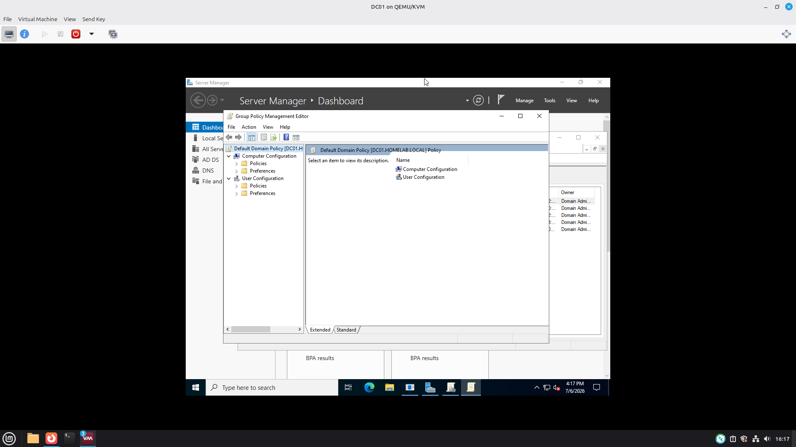
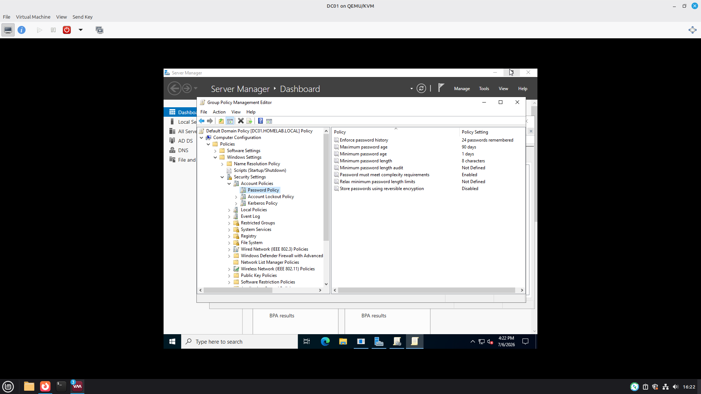
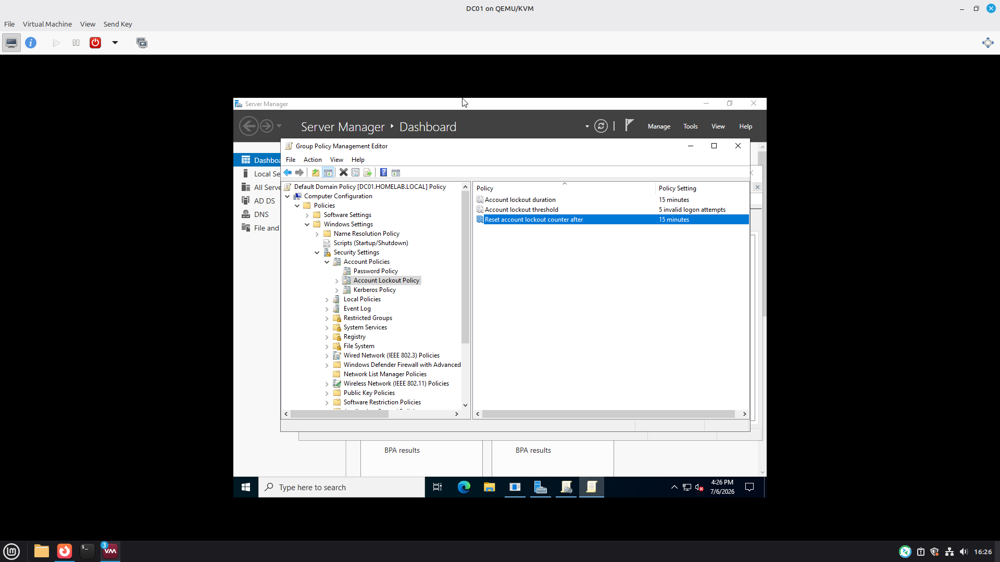

# Project-03 - Active Directory Password Policy

## Overview

This project demonstrates how to configure and enforce password security policies using Group Policy in a Windows Server 2022 Active Directory environment. Passowrd complexity, minimum length, password history, and account lockout settings were configured and validated from a Windows 10 domain client. 

---

## Environment

- Windows Server 2022
- Windows 10 Client
- Active Directory Domain Dervices (AD DS)
- Group Policy Management Console (GPMC)

---

## Objectives

- Configure Password Policy
- Configure Account Lockout Policy
- Apply Group Policy
- Force Policy Updates
- Test Password Complexity
- Verify Password Enforcement

---

## Skills Demonstrated

- Active Directory Administration
- Group Policy Management
- Windows Server 2022
- Password Security
- Account Lockout Policies
- Authentication Security
- Windows Administration
- Troubleshooting

---

# Screenshots

## Default Domain Policy

## Password Policy Settings

## Configured Password Policy

## Account Lockout Policy

## Group Policy Updated

## Weak Password Rejected

---

# Conclusion

This project demonstrated how to configure and enforce secure password policies using Group Policy in an Active Directory environment. Password complexity, password history, expiration, and account lockout settings were successfully configured and validated from a Windows client, reinforcing enterprise security best practices.
